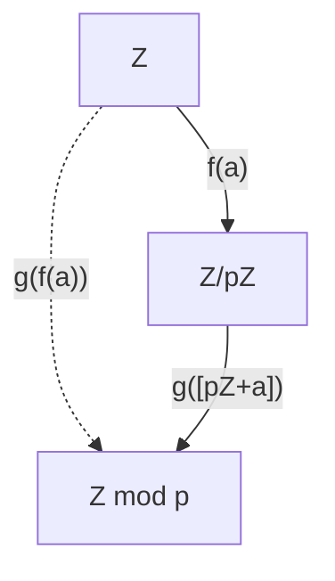

---
tags:
- proj/math/analysis 
---

# Frontmatter

## Inspiration

Note to self: 
- Number as geometric object 
	- 🔢 as {📐,📏,🧭,🔳,⚪️}
	- number as length of line segment
		- $1\in\mathbb{N}$ as unit
		- no zero
		- $q\in\mathbb{Q}$ as ratio $a:b$
	- addition as stacked sticks
	- multiplication as area of rectangle
	- division as sticks within a stick

## Work so far

We built N for arithmetic.

- $S(n):\mathbb{N}\to \mathbb{N}$
- $(\mathbb{N},+,0)$ <u>commutative monoid</u>
	- Recursively defined $f_{a}^{+}(b)$ on $S(b)$
- $(\mathbb{N}\setminus \{ 1 \},\cdot,1)$ <u>commutative group</u>
	- Recursively defined $f_{a}^{\cdot}(b)$ on $f_{a}^{+}(b)$
- $(\mathbb{N},\lt)$ <u>linear order</u>
	- Recursively defined on $S(n)$

$(\mathbb{N},+,\cdot,0,1,<)$ so defined *suffices* for NT but makes our overall development tedious. Why?
- Naturally we want our definitions to extend to $\mathbb{Z}$ without having to redefine
- Having to define all of our machinery in $\mathbb{N}$ recursively is kludgey like **clipped subtraction**

## Justification of Approach

> [!danger] Utility of NT
> - Number theory (divisibility), and the focus on integral domains and expressions with integer solutions enables us to reason about
> $$
> \mathbb{Q}=\left\{\frac{a}{b}\right\}\quad a,b\neq0\in\mathbb{Z}
> $$
> - $a$ and $b$ are **integers**
> - $\mathbb{Q}$ is a field
> - Analysis is about fields
> - E.g.
> 	- Division algorithm allows us to break down complex expression (with corresponding proposition relating to all of $\mathbb{Z}$, here: is $f(a)\in\mathbb{Z}$ for all $a\in\mathbb{Z}$?) into small, finite number of cases based on residue classes.
> 	$$
> 	f(a) = \frac{a(a^{2}+2)}{3}
> 	$$
> 	$r \in \{ 0,1,2\} \Rightarrow$ if $r=0$ then $3 \mid a(a^2+2) \Rightarrow$ $a=3\cdot q \Rightarrow$ 
> 	$$
> 	3\cdot f(a)=q(9q^2+2)
> 	$$
> 	which implies $f(a)$ is in $\mathbb{Z}$ (by closure properties of $\cdot$ and $+$ in rings). And then we show the same conclusion for $r=1$ and $r=2$.
> 	- Burton:
> 	> As these remarks indicate, the advantage of the Division Algorithm is that it allows us to prove assertions about all the integers by considering only a finite number of cases.

> [!success] The Point
> - Understand the algebra/arithmetic of rings and fields 
> 	- (mult, division, ineq, abs).
> - This algebra is foundational in Linear Algebra 
> 	- already covered the arithmetic of scalars 
> 	- linear combinations
> 	- LA is just vector space over scalar field
> 	- Matrices form rings etc
> - Understand analysis 
> 	- series -> integral -> sequence of partial sums -> limits 
> 	- but you've already taken 3 sem. calc. etc. 
> 	- now you've covered the algebra/arithmetic of fields 
> 	- you understand the logic of proof structures in analysis
> - Stats & probability lens on AI/ML/DL.

# Rings

## Goal: Products, Divisibility, Residue Classes
```
Multplication (Z,x)
a=bq
b|a iff b!=0 and Eq>0
Implicitly this is the form
a=bq+r where
b|a iff a=bq+0
But for any b!=0
Since 0<=r<b
a=bq+r in {0,1,2..b-1}
But then for every b in Z
Every integer is of the form

a=2q+r r in {0,1}
a=3q+r r in {0,1,2}
a=4q+r r in {0,1,2,3}
a=5q+r r in {0,1,2,3,4}
...
a=bq+r in {0,1,2..b-1}

which gives

a=x(mod b) iff a=bq+r and x=bq+r' $\Rightarrow$ r=r'
and
[a] = {x : a=x(modb)}

And if we define
a mod b := r where a=bq+r
mod(a,b):ZxZ->Z

This operation is well-defined by Division Lemma (existence and uniqueness property).

So: 

a=x(mod b) iff 
  mod(a,b)=mod(x,b) iff 
  a mod b = x mod b iff
  a=bq+r and x=bq'+r' $\Rightarrow$ r=r'
```

## Subrings and Ideals

### Subrings
- R ring and S subset R
- S (sub)ring iff
	- Trivial def
		- S ring
	- Compact def
		- S closed w.r.t. subtraction
			- Thm. S closed w.r.t subtraction iff S closed w.r.t. addition and negatives (doesn't this just mean (S,+,0) is a group?)
		- S closed w.r.t. multiplication
- Absorption
	- B subset R ring
		- B absorbs products in R iff Vx in R Vb in B xb and bx are in B
### Ideals

> [!definition]
> A subring that absorbs products in (a commutative ring with unity) R is an ideal

> [!theorem]
> In a ring $R$ with fixed $a \in R$ the set
> $$
> \{x\cdot a \;\vert\; x \in R\}
> $$
> is called an **ideal** of $R$.

> [!proof]
> - $xa$ for fixed $a$ and all $x \in R$ is an **ideal**.
> 	- Show: xa subring
> 		- xa,ya in S Vx,y in R $\Rightarrow$ xa + ya = (x+y)a in S since z=(x+y) in R and za in S
> 		- xa in S $\Rightarrow$ -(xa) in S
> 			- Since -(xa) = (-x)a and (-x) in R
> 	- xa subring QED
> 	- Show: xa ideal
> 		- xa in S,R $\Rightarrow$ if y in R then xya in R. But xya=(xy)a and z=(xy) in R $\Rightarrow$ za in S.
> 	- xa ideal QED

> [!mexample]
> - $ax = aZ = \{ax : x \in Z\}$
> - $2Z = \{2x : x \in Z\} = \{\text{evens}\}$

Note the progression towards higher-order forms
- Division Algorithm
	- $xa + r\cdot1$
- Linear Combinations
	- $xa + yb$
	- $xa + x'a' + x''a'' + ...$
- Polynomials
	- See ChatGPT conversation

> [!theorem]
> 1. Every ideal is a subring.
> 2. Not every subring is an ideal.
> 3. Every subring of $\mathbb{Z}$ is an ideal.
> 4. $\mathbb{Z}$ is an ideal of $\mathbb{Z}$ ($(1)=(-1)$).
> 5. But in the context $\mathbb{Z}\subset\mathbb{Q}$, $\mathbb{Z}$ is not an ideal.
> 	- Because it doesn't absorb non-integral rationals, e.g. $\frac{1}{2}$

### Generators 

Like subgroups, subrings (and ideals) may or may not be generated by a single element.

> [!definition]
> In the case where a subring (or ideal) $S\subseteq R$ is generated by a single element $a\in S$, written $S=(a)$ we call $a$ the **generator** of $S=(a)$.

> [!detail]
> A subring with a generator is not necessarily an ideal

> [!definition]
> If an ideal *can be* generated by a single element it's called a **principal ideal**.

> [!mexample]
> The set of all multiples of some fixed integer $m\in \mathbb{Z}$ 
> $$
> (m)=m\mathbb{Z}=\{ m\cdot n \;\vert\; n\in \mathbb{Z} \}
> $$
> is a **principal ideal** of $\mathbb{Z}$.

> [!remark]
> There can be more than one generator like $\{-1,1\}$ for $\mathbb{Z}$. But so long as there's *at least one* generator the ideal is principal.
Note that in $\mathbb{Q}$, $\mathbb{Z}$ does not have a generator (because $1$ would incorporate non-integral rationals from the larger ring (field) $\mathbb{Q}$) and is not an ideal -- let alone a **principal ideal**.

> [!theorem]
> All the ideals $m\mathbb{Z}$ of $\mathbb{Z}$ are principal.

### Subrings Generated by Multiple Elements

> [!remark]
> Subrings of a ring $R$ can be generated by multiple elements $a_{1},a_{2},a_{3},\ldots$ of $R$.

> [!definition]
> The subring of $R$ generated by $a_{1},a_{2}\in R$ is
> $$
> (a_{1},a_{2})=\{ a_{1}s+a_{2}t \;\vert\; s,t\in R\}.
> $$

> [!remark]
> The subring $(a_{1},a_{2})=\{ a_{1}s+a_{2}t \;\vert\; s,t\in R\}$ is the set of all **linear combinations** of $a_{1}$ and $a_{2}$.

There can be more than two generators. Here we limit ourselves to an arbitrary but finite number of generators.

> [!definition]
> The subring of $R$ generated by the $n$ ring members $\{ a_{i}\in R \;\vert\; 0\lt i\lt n\in \mathbb{N}\}$ is
> $$
> (a_{1},a_{2},\ldots,a_{n})=\left\{  a_{1}x_{1}+a_{2}x_{2}+\cdots+a_{n}x_{n}=\sum_{i=1}^{n}a_{i}x_{i} \;\vert\; s,t\in R \right\}.
> $$

### Noetherian Rings and Hilbert Basis Theorem

Rings, subrings, and ideals need not be finitely generated. That is, there exist $R$ such that 
$$
R=(\{ a_{i} \;\vert\; i\in I \})
$$
where $I$ is (un)countably infinite.

> [!remark]
> In modern algebra there is the study of (sub)rings that are generated by an infinite number of generators, such as $R[\{ x_{i} \}_{i\in I}]$ where $I=\mathbb{N}$ is the ring of polynomials in infinitely many variables - which is often used in algebraic geometry and commutative algebra.

There is a special class of rings whose ideals are **finitely generated**.

> [!definition]
> A **Noetherian ring** is a ring $R$ that satisfies the **ascending chain condition** for its ideals.
> 
> That is, every increasing sequence 
> $$
> I_{1}\subseteq I_{2}\subseteq I_{3}\subseteq \cdots
> $$
> of ideals has a largest element $I_{n}$. 
> 
> I.e., there exists $n\in \mathbb{N}$ such that 
> $$
> I_{n}=I_{n+1} = \cdots.
> $$

> [!theorem] Hilbert Basis Theorem
> In a **Noetherian ring** every ideal is finitely generated.

> [!mexample]
> Every field $F$, and the ring of integers $\mathbb{Z}$, is a **Noetherian** ring.

> [!theorem]
> Not every **finitely generated ring** $R$ is **Noetherian**.


### Ring Homomorphisms

> [!definition]
> A **homomorphism** from a ring $A$ to a ring $B$ is a function $\varphi:A\to B$ satisfying the identities
> - $\varphi(x_{1}+_{A}x_{2}) = \varphi(x_{1})+_{B}\varphi(x_{2})$
> - $\varphi(x_{1}\cdot_{A} x_{2}) = \varphi(x_{1})\cdot_{B}\varphi(x_{2})$
> 
> Where the ring operations are subscripted with their appropriate domain.

> [!mexample]
> - $\varphi_{1}:\mathbb{Z}\to \mathbb{Z}/2\mathbb{Z}$ 
> - $\varphi_{2}:\mathbb{Z}/6\mathbb{Z}\to \mathbb{Z}/3\mathbb{Z}$

> [!remark]
> A **ring homomorphism** effectively *factors out* unnecessary structure from the ambient ring (domain) to focus on the structure we wish to preserve in the codomain.
> 
> Such as even-odd parity in the **homomorphism** $\varphi:\mathbb{Z}\to \mathbb{Z}/2\mathbb{Z}$ defined by $\varphi(n)=n\pmod 2$.

We develop this idea below, after introducing the notion of cosets, and see that each **ring homomorphism** defines an associated **quotient ring**.

> [!definition]
> The **kernel** of a **ring homomorphism** $\varphi:A\to B$ is the set of elements from the domain $A$ that are mapped to zero in the codomain $0\in B$
> $$
> K = \{a \in A: \varphi(a)=0\}.
> $$

> [!theorem]
> The **kernel** $K$ of a **ring homomorphism** $\varphi:A\to B$ is an **ideal** of $A$.

Next we'll see that this fact enables us to *construct* all homomorphic images of a ring $A$.

### Cosets and Quotient Rings

Cosets get us even closer to the fundamental forms of interest in algebra and analysis 
- division: $a=bq+r$
- linear combinations: $c=ax+by$
- polynomials: $0=ax^2 + bx + c$
- ratios: $e=\frac{ax^2 + b}{cx-d}$

by including an additive term $a$ in addition to the product $bq$ we just studied. The added term enriches the ring structures we can analyze beyond ideals.

> [!remark]
> Recall that an **ideal** of a ring $A$ is a set of the form
> $$
> J=\{ j\cdot n\;\vert\; n\in A \}
> $$
> for $j\in A$ fixed.

> [!mexample]
> E.g.
> $$
> J = \{3n\;\vert\;n\in\mathbb{Z}\} = (3) = 3\mathbb{Z}
> $$
> is an **ideal** of $\mathbb{Z}$ consisting of the multiples of $3$.

> [!definition]
> A **coset** of a ring $A$ is an ideal $J$ together with a fixed ring member $a\in A$ forming the set
> $$
> J=J+a=\{ j+a \;\vert\; j\in J\}.
> $$

> [!mexample]
> For the ideal $J=3\mathbb{Z}=\{ 3n\;\vert\;n\in \mathbb{Z} \}$ and for $a=1\in \mathbb{Z}$, the set 
> $$
> J+a=3\mathbb{Z}+1=\{ 3n+1\;\vert\;n\in \mathbb{Z} \}
> $$
> is a **coset** of the ring $\mathbb{Z}$.

Cosets are related to ideals, but what type of structure are they?

> [!theorem]
> If $a\neq 0$ then the **coset** $J+a$ is ***neither***
> - a subring of $A$
> - an ideal of $A$

> [!theorem]
> If $a=0$ then the **coset** $J+a=J+0=J$ and therefore is ***both***
> - a subring of $A$
> - an ideal of $A$

Consider the set of all cosets of a given ideal $J$, that is all (co)sets of the form
$$
J+a
$$
for all $a\in A$.

What structure does this collection possess?

> [!theorem]
> The collection of all cosets of a given ideal $J$
> $$
> \{ J+a\;\vert\; a\in A \}
> $$
> partitions the ring $A$.

We now define coset addition and multiplication in anticipation of the algebraic structure that the above set possesses. 

> [!definition]
> **Coset addition and multiplication**
> 
> Treating these cosets themselves as elements they can be added and multiplied
> $$
> \begin{aligned}
> (J+a)+(J+b)&=J+(a+b) \\
> (J+a)\cdot(J+b)&=J+(a\cdot b)
> \end{aligned}
> $$

> [!remark]
> We omit the theorem and careful proof that gaurantees the sum and product of cosets as defined are determined without ambiguity.
> 
> See Pinter pg. 188 Ch. 19 for details.

> [!theorem]
> The collection of cosets of a given ideal $J$ of a ring $A$ under the coset addition and multiplication defined above 
> $$
> (\{ J+a\;\vert\; a\in A \},+,\cdot)
> $$
> forms a ring.

> [!definition]
> The ring of cosets of ideal $J$ in ring $A$ is denoted 
> $$
> A/J = (\{ J+a\;\vert\; a\in A \},+,\cdot)
> $$
> and called a **quotient ring** of $A$.

> [!caution] Dangerous Bend
> 
> Carefully note the difference between:
> - $\mathbb{Z}_{3}$
> - $3\mathbb{Z}$
> - $3\mathbb{Z}+a$
> - $\mathbb{Z} / 3\mathbb{Z}$
> 
> where
> - $\mathbb{Z}_{3}$ is the **ring**  $(\mathbb{Z},+_{\text{mod 3}},\cdot_{\text{mod 3}})$
> - $3\mathbb{Z}$ is an **ideal** of the ring $\mathbb{Z}$
> - $3\mathbb{Z}+a$ is a **coset** of the ring $\mathbb{Z}$
> - $\mathbb{Z} / 3\mathbb{Z}=\{ 3\mathbb{Z}+a \;\vert\; a\in \mathbb{Z}\}$ is the **quotient ring** of cosets of $3\mathbb{Z}$.

### Fundamental Ring Homomorphism Theorem

Much like the **fundamental homomorphism theorem** for groups, there is a fundamental connection between the quotient rings of a ring $A$ and its homomorphic images.

Recall:

> [!definition]
> A **homomorphism** between rings $A,B$ is a function $f:A\to B$ that preserves ring operations and ring unity.
> 
> That is
> - $f(a+b) = f(a)+f(b)$
> - $f(ab) = f(a)f(b)$
> - $f(1_{A}) = 1_{B}$

> [!definition]
> The **kernel** of a homomorphism $f:A\to B$ is the set of elements of $A$ mapped to $0\in B$ by $f$
> $$
> ker(f)=\{ a\in A\;\vert\; f(a)= 0\}
> $$

> [!theorem]
> Every ideal $J$ of a commutative ring with unity $A$ is the **kernel** of some homomorphism $f:A\to B$ **onto** ring $B$.
> 
> That is
> - $A,B$ commutative rings with unity
> - $J$ ideal of $A$
> - $\exists\,f:A\to B$ with $f$ **ring homomorphism**
> $$
> ker(f)=J
> $$
> 

> [!theorem] Theorem 3
> The surjection $f:A\to A / J$  defined by
> $$
> f(a) = J+a\quad\forall\,x\in A.
> $$
> is a homomorphism.
> 
> The function $f$ is called the **natural homomorphism**.
> 

> [!theorem] Corollary
> $A / J$ is a homomorphic image of $A$.

> [!proof]
> The **natural homomorphism** $f$ maps $A\to A/J$.
> 
> Since $f$ is a homomorphism $A/J$ is a homomorphic image of $A$. $\,\square$

> [!theorem] Theorem 4
> Let 
> $$
> f:A\to B
> $$
> be a homomorphism from ring $A$ **onto** ring $B$, and let $K$ be the **kernel** of $f$.
> 
> Then 
> $$
> A/ker(f) \cong B.
> $$

> [!mexample]
> In the following commutative diagram the **natural homomorphism** $f$ maps members of $a\in \mathbb{Z}$ to a members (cosets) of the quotient ring $\mathbb{Z}/p\mathbb{Z}$ defined by the ideal $p\mathbb{Z}$.
> 
> That is, $f$ sends integers to their corresponding cosets of the ideal $p\mathbb{Z}$
> $$
> a\overset{f}{\leadsto} p\mathbb{Z}+a.
> $$
> 
> The function $g(p\mathbb{Z}+a)$ maps equivalence classes of cosets (residue classes) to members of the ring (field) $\mathbb{Z}\text{ mod p}$.
> 
The composition $g \circ f$ of the natural homomorphism $f$ and the equivalence map $g$ commute, and under the theorem above proves that blah blah see [[Homomorphisms and Quotient Rings]] and ChatGPT for this partially understood stuff.




# Integral Domains

In our development of algebraic systems we build upon what has already been established by  adding properties, relations and operators which serve to distinguish the number systems of interest as particular concrete types within the larger scope of abstract types.

We now close in on the integers $\mathbb{Z}$ by insisting that the commutative rings with unity we have studied possess  additional an additional property.

Well, really two properties that turn out to be equivalent
- the cancellation property
- and absence of non-trivial divisors of zero.

## Cancellation Property

Familiar to those who've learned arithmetic in the integers is the ability to "cancel" a common multiplicative factor from either side of an equation.

However this "cancellation" operation is not an operation, it is the ability to soundly deduce that two ring members are equal when multiplied by a common factor.

This deduction is not always sound in just any commutative ring with unity.

> [!definition]
> A commutative ring with unity $R$ has the **cancellation property** if and only if for $a\neq 0$
> $$
> \begin{aligned}
> ab&=ac \Rightarrow \\
> b&=c
> \end{aligned}
> $$

> [!remark]
> In any commutative ring with unity if we are given
> $$
> b=c
> $$
> we can always conclude
> $$
> ab=ac
> $$
> by the closure property of multiplication.
> 
> However, if we are given only
> $$
> ab=ac
> $$
> we cannot, in general, conclude
> $$
> b=c
> $$
> without additional guarantees on the ring.

In symbols, the above remark can be stated
$$
b=c\vdash ab=ac
$$
but
$$
ab=ac\not\vdash b=c.
$$

## Zero Divisors

> [!remark]
> In arithmetic with integers we are used to property that if
> $$
> ab=0
> $$
> then either $a=0$ or $b=0$.

In commutative rings with unity, however, this is not always the case. 

> [!definition]
> In a commutative ring with unity $R$
> - if $ab=0$ for some $a,b\in R$
> 
> then $a$ and $b$ are called **zero divisors**.

> [!remark]
> The definition above implies that $0$ is a **zero divisor** in $R$.
> 
> But it is often disregarded or considered "trivial".


## Integral Domain

> [!definition]
> A commutative ring with unity $R$ is called an **integral domain** if and only if
> - $R$ has the cancellation property or
> - $R$ has no non-trival zero divisors 

> [!theorem] Corollary
> In a commutative ring with unity $R$ the following properties are equivalent
> - $R$ has the cancellation property
> - $R$ has no non-trival zero divisors 
> 
> and distinguish $R$ as an **integral domain**.

The connection between zero divisors and the cancellation property is as follows.

The lack of the cancellation property $ab = ac \Rightarrow b = c$ hinges critically on the existence of zero-divisors:
- When $a = 0$, $ab = ac$ trivially holds, but $b$ and $c$ are unconstrained.
- When $a \neq 0$, zero-divisors can annihilate $b - c \neq 0$, making $ab = ac$ consistent with $b \neq c$.

See [[Cancellation and Zero Divisors|this note]] for expanded detail.

## Notation

The following notation is used in groups, rings, integral domains and introduced here to define next the **characteristic** of an integral domain.

#### Laws of Exponents

For $a\in (G,\cdot)$ group and $m,n\in \mathbb{Z}$

> [!definition]
> $\prod_{i=1}^n a_i = \overbrace{a\cdot a\cdot \cdots a }^\text{n times}= a^{n}$

> [!theorem]
> - $a^{n}\cdot a^{m}=a^{n+m}$
> - $(a^m)^n=a^{m\cdot n}$
> - $\frac{a^m}{a^n}=a^{m-n}$
> - $a^{-m}=\frac{1}{a^m}$
> - $(ab)^m=a^m\cdot a^n$
> - $\left( \frac{a}{b} \right)^m=\frac{a^m}{a^m}$
> - $a^0=1$
> - $a^1=a$

#### Multiples

For $a\in (G,+)$ group and $m,n\in \mathbb{Z}$

> [!definition]
> $\sum_{i=1}^n a_i=\overbrace{a+a+\cdots +a}^\text{n times}=n\cdot a$
> - $(-n)\cdot a=-(n\cdot a)$
> - $0\cdot a=0$

> [!theorem]
> - $n\cdot a + m\cdot a=(n+m)\cdot a$
> - $n\cdot (m\cdot a)=(n\cdot m)\cdot a$
> - $1\cdot a=a$

## Characteristic

> [!definition]
> Order of a group element
> - Least $n>0$ such that $n\cdot a=0$.
> - If no such $n$ than $a$ has order $\infty$

> [!definition]
> Characteristic in ring with unity
> - If $1$ has order $n$ then ring has characteristic $n$.

That is: the **characteristic** of a ring with unity is the **additive order** of $1$.

> [!theorem]
> - If an integral domain with has characteristic $n>0$ then
> $$
> n \text{ prime.}
> $$
> - In an integral domain with characteristic $p$
> $$
> (a+b)^p = a^p +b^p.
> $$
> - A finite integral domain is a field.

## Ordered Integral Domain

> [!definition]
> An integral domain $A$ with an ordering relation $<$ is an **ordered integral domain** iff
> - $<$ is trichotomous
> - $<$ is compatible with the ops in $(A,+,\cdot)$ 
> 	- $a<b$ and $b<c$ then $a<c$
> 	- $a<b$ then $a+c<b+c$
> 	- $a<b$ then $ac<bc$ (only?) if $0<c$

> [!theorem]
> Let $A$ be an **ordered** integral domain and $a,b,c\in A$.
> - $a^2-2ab+b^2\geq 0$
> - $a^2+b^2\geq 2ab$
> - $a^2+b^2\geq ab$
> - $a^2 + b^2\geq -ab$
> - $a^2+b^2+c^2\geq ab+bc+ac$
> - $a^2+b^2\gt ab$ if $a\neq b$
> - $a+b\leq ab+1$ if $a,b\geq 1$
> - $ab+ac+bc+1\lt a+b+c+abc$ if $a,b,c\gt 1$

## Integral Systems

> [!definition]
> An ordered integral domain $(A,<)$ is an **integral system** if every non-empty set of positive elements
> $$
> A^+=\{ a>0\in A \}
> $$
> has a least element.

### Well-ordering

> [!definition]
> The property that
> $$
> \text{min}(\{ a>0\in A \})
> $$
> exists and is unique for non-empty positive subsets of an integral domain is called **well-ordering**.

> [!mexample]
> $\mathbb{Q}$ is an **integral domain** but not an **integral system**.
> - Because it's positive elements cannot be well-ordered
> - e.g.  
> $$
> \{ 0<x\in \mathbb{Q} \}
> $$
> has no least element.

> [!theorem]
> Every finite integral domain $A$ is a field (with prime order).
> 
> $A$ is not an **integral system**.

> [!proof]
> A finite field cannot be totally ordered in a way that is compatible with its operations.

> [!theorem]
> There is no element between 0 and 1 in an integral system.

> [!proof]
> Suppose $A$ is an integral system in which there are numbers $x$ between $0$ and $1$. Then the set
> $$
> \{ x\in A\;\vert\; 0<x<1\}
> $$
> is a non-empty set of positive members of $A$. So by the **well-ordering principle** $A$ has a least element $c$. That is
> $$
> 0<c<1
> $$
> and $c$ is the least element with this property. But then multiplying the inequality by $c$ we have
> $$
> 0<c^2<1\cdot c.
> $$
> Thus $c^2$ is in $A$ (and so between $0$ and $1$) and less than $c$. But $c$ is the minimal element, which contradicts the premise. Thus there is no number between $0$ and $1$. $\,\square$

# The Integers

> [!theorem]
> In an **integral system** every element $a\in A$ is a multiple of $1$.

> [!theorem]
> The elements of an **integral system** $A$ are totally ordered as in $\mathbb{Z}$.

> [!theorem]
> Every **integral system** is isomorphic to $\mathbb{Z}$

# Number Theory

With addition and multiplication now developed in the theory of rings, and the corresponding number systems $\mathbb{Z}$ defined we are prepared to investigate one of the richest structures in elementary algebraic systems, indeed in much of mathematics: divisibility.

## Divides

The **divides** relation provides the primary scaffolding within the integers upon which much else hangs.

> [!definition]
> For $a,b\neq 0\in \mathbb{Z}$ we have $b\mid a$ iff $\exists\;q\in \mathbb{Z}$ such that $a=bq$.

> [!theorem]
> If $b\mid a$ then so does $(-b)$

> [!proof]
> Since 
> - $b\mid a$ iff $\exists\,q\big(a=bq\big)$. 
> - So $a=bq$ which implies $a=(-b)(-q)$.
> 
> Therefore $(-b)\mid a$. $\;\square$

Some of the properties of the **divides** relation are as follows.

> [!theorem]
> - $a|0$, $1|a$,$a|a$
> - $a|1$ iff $a=\pm 1$
> - $a\mid b$ and $c\mid d$, then $ac\mid bd$.
> - $a\mid b$ and $b\mid c$, then $a\mid c$
> - $a|b$ and $b|a$ iff $a=\pm b$
> - $a\mid b$ and $b\neq 0$, then $|a|\leq|b|$
> - $a|b$ and $a|c$ then $a|(bx+cy)$

> [!proof]
> My proofs [[Divides Proofs (Burton)|here]].

The last property of **divides** can be extended to a linear combination with an arbitrary number of terms.

> [!theorem]
> If $a\mid b_{k}$ for $k = 1,2,...,n$, then 
> $$
> a\mid (b_{1}x_{1} + b_{2}x_{2} +···+b_{n}x_{n})
> $$
> for all integers $x_{1}, x_{2},...,x_{n}$.

The few details needed for the proof are so straightforward that we omit them.
 
## Common divisors

> [!definition]
> If 
> - $a|b$ 
> - $a|c$
> 
> then 
> - $a$ is a **common divisor** of $b$ and $c$.

> [!remark]
> Recall from **Theorem 2.2** that $1|n\quad\forall n\in \mathbb{Z}$.

Therefore

> [!theorem]
> The set of **common divisors** of $a,b\in \mathbb{Z}$
> $$
> \text{cd}(a,b) = \{ d : d|a \;\land\; d|b \}
> $$
> is non-empty.

> [!theorem]
> Since $d|0\;\forall d\in \mathbb{Z}$ the set 
> $$
> \text{cd}(0,0) = \mathbb{Z}.
> $$

> [!theorem]
> If $a\neq 0$ or $b\neq 0$ then $\text{cd}(a,b)$ is finite.

> [!theorem] Corollary
> If $a\neq 0$ or $b\neq 0$ then $\text{cd}(a,b)$ has a max and min, that is: 
> $$
> \exists!\, m,n\quad m=\text{max}(\text{cd}(a,b))\quad\text{and}\quad n=\text{min}(\text{cd}(a,b)).
> $$

## Greatest Common Divisor

The greatest common divisor, or gcd, is of fundamental importance in number theory and arithmetic.

> [!definition]
> If $a\neq 0$ or $b\neq 0$ then there exists a unique positive integer $d$, called the **greatest common divisor**, or $gcd(a, b)$, satisfying:  
> 
> - $d|a$ and $d|b$
> - If $c|a$ and $c|b$ then $c\leq d$.

## Bezout's Lemma


> [!theorem] Bezout's Lemma
> If $a\neq 0$ or $b\neq 0$ then there exist integers $x,y$ such that:
> $$
> \begin{aligned}
> gcd(a,b) = ax+by
> \end{aligned}
> $$

> [!proof]
> See Burton's proof [[gcd as linear combination proof|here]].
> See a similar proof [here](https://math.libretexts.org/Bookshelves/Combinatorics_and_Discrete_Mathematics/Elementary_Number_Theory_(Clark)/01%3A_Chapters/1.08%3A_Bezout's_Lemma).

> [!remark]
> Bezout's Lemma only gives an existence proof of the integers $x,y$ in $gcd(a,b)=ax+by$.
> 
> It does not provide an effective procedure for identifying such integers.

### Solving Bezout's Identity

> [!remark]
> Solving Bezout's Identity is equivalent to solving a Linear Diophantine Equation 
> $$
> c=ax+by
> $$
> where, here, $c=gcd(a,b)$.

Two methods for producing solution to Bezout's identity are
1. The Extended Euclidian Algorithm
2. Blankinship's Method

The Extended Euclidian Algorithm
- Definition
- Proof

Blankinship's Method
- Definition
- Proof

These methods are covered in detail in a later section on Diophantine Equations.


#### Corollary 

> [!theorem]
> If $a,b\in\mathbb{Z}$ fixed, not both zero, then the set 
> $$
> T =\{ax+by \;\vert\; x,y\in \mathbb{Z} \} 
> $$
> is precisely the set of all multiples of 
> $$
> d = gcd(a,b)
> $$
> that is
> $$
> T =\{ax+by \;\vert\; x,y\in \mathbb{Z} \} = \{ n\cdot gcd(a,b) \;\vert\; n\in \mathbb{Z} \}
> $$

## Relatively Prime

> [!definition]
> $a,b\in \mathbb{Z}$ not both zero are **relatively prime** iff
> $$
> gcd(a,b)=1.
> $$

> [!theorem]
> $a,b\in \mathbb{Z}$ not both zero. Then $a,b$ **relatively prime** iff 
> $$
> \exists\,x,y\in \mathbb{Z}\quad1=ax+by
> $$

> [!remark]
> Isn't this just: gcd(a,b)=ax+by and a,b relprime iff gcd(a,b)=1 +> 1=ax+by $\Rightarrow$ a,b relprime?

> [!theorem] Corollary
> If $gcd(a,b)=d$ then $gcd(\frac{a}{d},\frac{b}{d})$.

> [!theorem] Corollary
> If $a|c$ and $b|c$ with $gcd(a,b)=1$ then $ab|c$.

## Euclid's Lemma

> [!theorem] Euclid's Lemma
> If $a|bc$ with $gcd(a,b)=1$ then $a|c$

> [!theorem]
> Let $a,b\in \mathbb{Z}$ not both zero. For $d>0\in \mathbb{Z}$, $d=gcd(a,b)$ iff
> 1. $d|a$ and $d|b$
> 2. Whenever $c|a$ and $c|b$, then $c|d$

## Euclid's Algorithm (gcd)

### Motivation

> [!remark]
> To compute the $gcd(a,b)$ for $a,b\in \mathbb{Z}$  by brute force is
> $$
> O(n\cdot \log n).
> $$
> 
> Whereas **Euclid's Algorithm**, from *Book VII* of *Elements*, is 
> $$
> O(\log n).
> $$

> [!remark]
> It's supposed that this algorithm was known before the time of Euclid (325-265 BC).

### Euclid's GCD hack

Before looking at Euclid's Algorithm we examine a hack that enables the algorithm to efficiently and correctly compute the result.

> [!theorem] Euclid's Hack
> If $a=bq+r$ then
> $$
> gcd(a,b)=gcd(b,r).
> $$

> [!proof]
> If $d=gcd(a,b)$, then the relations $d|a$ and $d|b$ together imply that $d|(a-qb)$ or $d|r$. Thus, $d$ is a common divisor of both $b,r$.
> 
> On the other hand, if $c$ is an arbitrary common divisor of $b,r$, then $c|(qb+r)$, whence $c|a$. This makes $c$ a common divisor of $a,b$, so that $c\leq d$.
> 
> Now it follows from the definition of $gcd(b,r)$ that $d=gcd(b,r)$.

### Euclid's Algorithm

> [!definition] Euclid's Algorithm
> 1. Start with two positive integers a and b ($a \geq b$).
> 2. Perform successive divisions:
> 
> 	- At each step, solve the relation below for $(q,r)$ using the Division Algorithm:
> 	
> 	$$
> 	a = bq + r, \quad \text{where } 0 \leq r < b.
> 	$$
> 	
> 	- Assign $a\to b$ and $b\to r$, and repeat until $r=0$.
> 	
> 1. The final non-zero quotient in the sequence is $gcd(a, b)$.


> [!remark]
> Euclid's Algorithm results in a system of equations like the following: 
> $$
> \begin{aligned}
> a&=q_{1}b+r_{1} \\
> b&=q_{2}r_{1}+r_{2} \\
> r_{1}&=q_{3}r_{2}+r_{3} \\
> &\vdots \\
> r_{n-2}&=q_{n}r_{n-1}+r_{n} \\
> r_{n-1}&=q_{n+1}r_{n}+0 \\
> \end{aligned}
> $$
> Where $r_n$, the last non-zero remainder, is $gcd(a,b)$.

With the result of **Euclid's Hack** we can work backward through the above system of equations and find $gcd(a,b)$ by
$$
gcd(a,b)=gcd(b,r_{1})=\cdots=gcd(r_{n-1},r_{n})=gcd(r_{n},0)=r_{n}
$$

### Proof of Euclid's Algorithm

which follows from [[Proof of Euclid's Algorithm|the proof]].

> [!theorem] Lemma
> 
> If $k>0$ then 
> $$
> gcd(ka,kb)=k\cdot gcd(a,b)
> $$

Corollary

> [!theorem] Corollary
> For any $k\neq 0$:
> $$
> gcd(ka,kb)=|k|\cdot gcd(a,b).
> $$

## Least Common Multiple

> [!definition] Least Common Multiple
> The  **least common multiple** of $a,b\in \mathbb{Z}$ both non-zero, denoted $lcm(a,b)$, is $m>0\in \mathbb{Z}$ satisfying:
> 1. $a|m$ and $b|m$.
> 2. If $a|c$ and $b|c$, with $c>0$, then $m\leq c$.


> [!theorem]
> For $a,b\in \mathbb{Z}$ $a,b>0$
> $$
> gcd(a,b)\cdot lcm(a,b)=ab
> $$


> [!theorem]
> $$
> lcm(a,b)=ab \Leftrightarrow gcd(a,b)=1
> $$

## Generalized gcd(a,b,c,..)

> [!definition]
> The gcd of more than two integers $A=\{a_{1},a_{2},a_{3},\ldots\}$ is defined as
> $$
> d=gcd(\{a_{1},a_{2},a_{3},\ldots\})
> $$
> if and only if
> 1. $d|a_{i}$ for all $a_{i}\in A$.
> 2. If $e|a_{i}$ for all $a_{i}\in A$ then $e\leq d$.

## Diophantine Equations

### Introduction

> [!definition]
> A **Diophantine equation** is typically 
> - a [polynomial equation](https://en.wikipedia.org/wiki/polynomial_equation)
> - in two or more [unknowns](https://en.wikipedia.org/wiki/unknown_(mathematics))
> - with [integer](https://en.wikipedia.org/wiki/integer) coefficients,
> - for which only [integer](https://en.wikipedia.org/wiki/integer) solutions are of interest.

A **linear Diophantine equation** equates to a constant the sum of two or more [monomials](https://en.wikipedia.org/wiki/monomials), each of [degree](https://en.wikipedia.org/wiki/Degree_of_a_polynomial) one.

> [!mexample]
> The equation
> $$
> c = ax + by
> $$
> is a **linear Diophantine equation**.

An **exponential Diophantine equation** is one in which unknowns can appear in [exponents](https://en.wikipedia.org/wiki/exponent).

> [!mexample]
> Equations of the form
> $$
> a^2 + b^2 = c^2.
> $$
> are **quadratric Diophantine equations** and there are infinitely many solutions, called Pythagorean Triples.

> [!theorem] Fermat's Last Theorem
> 
> There are no integer solutions to
> $$
> a^n + b^n = c^n
> $$
> for $n>2$.

> [!definition]
> **Fermat's Last Theorem** is an example of an **exponential Diophantine equation**.

### Linear Diophantine Equations

> [!remark]
> While there is no general method to solve all varieties of Diophantine equations, and often only conjectures as for which varieties solutions even exist, there are existence proofs and methods for solving certain varieties, such as linear Diophantine equations, those of the form
> $$
> c = ax + by.
> $$

We know $gcd(a,b)|ax+by$ right?
This is Bezout's Lemma.
- But then how do we find particular solutions?
- Are these all the solutions?

### Extended Euclidian Algorithm

How do we find the unknowns guaranteed to exist by Bezout's Lemma?

Well, Bezout's Lemma is a Linear Diophantine Equation.

And with Euclid's Algorithm, by tracking some additional information, we can generate a *seed pair* of solutions - a pair whence others may constructed.

### Blankinship's Method

In the August-September 1963 issue of *American Mathematical Monthly*, W.A. Blankinship gave a simple method to produce the integers $x$ and $y$ in Bezout’s Lemma and at the same time produce $gcd(a,b)$:

# End

---

See the beauty of this development, realized in `Coq`:

```coq
Inductive nat : Type :=
  | O : nat         (* Zero *)
  | S : nat -> nat. (* Successor *)

Fixpoint sub (n m : nat) : nat :=
  match n, m with
  | O, _ $\Rightarrow$ O
  | n, O $\Rightarrow$ n
  | S n', S m' $\Rightarrow$ sub n' m'
  end.

Fixpoint div_mod (a b : nat) : nat * nat :=
  match a with
  | O $\Rightarrow$ (O, O)  (* Base case: 0 divided by anything is (0,0) *)
  | S a' $\Rightarrow$
      let (q, r) := div_mod a' b in
      if sub b r = O  (* Is remainder less than divisor? *)
      then (q, S r)  (* Increment remainder *)
      else (S q, sub r b)  (* Otherwise, increment quotient *)
  end.
```

And a computation

```coq
Compute div_mod (S (S (S (S (S (S (S O))))))) (* 7 *)
                (S (S (S O))). (* 3 *)
(* Step-by-step trace (conceptually):
  div_mod 7 3
  -> let (q, r) := div_mod 6 3 in ...
  -> let (q, r) := div_mod 5 3 in ...
  ...
Final Result: (S (S O), S (S O)) = (2, 1)
*)
```

---

Rings
Integers
Polynomials
Fields
Rationals
Reals

Analysis
- Sequences
- Limits
- Continuity
- Derivative
- Integral
- Metric Spaces
- Measure Theory

---

Linear Algebra
Probability
Stats
Optimization
Machine Learning

